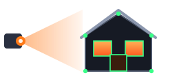
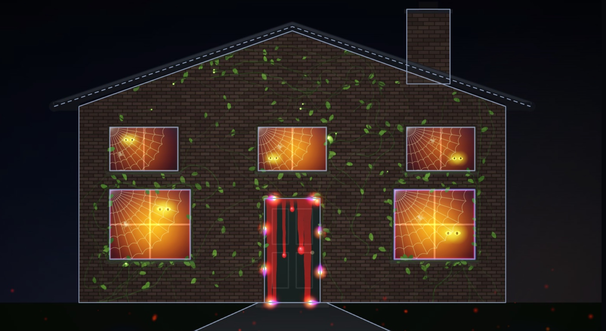
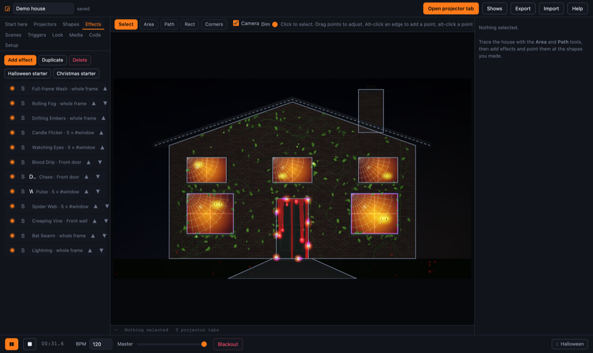

<p align="center">
  
</p>

<h1 align="center">Facade Mapper</h1>

<p align="center">
  Projection mapping for your house, in a browser tab.<br />
  No install, no server, no account.
</p>

<p align="center">
  <a href="https://paperclipmonkey.github.io/facade-mapper/"><b>Open it →</b></a>
  &nbsp;·&nbsp;
  <a href="https://paperclipmonkey.github.io/facade-mapper/?demo"><b>Try the demo house →</b></a>
</p>

<p align="center">
  
</p>

Point a camera at the front of the house, let each projector find itself, trace
the windows and the door, and put light on them. Built for Halloween and
Christmas, but there is nothing seasonal in the engine — it maps shapes to
projectors and runs programmable effects on them.

**No projector to hand?** The
[demo house](https://paperclipmonkey.github.io/facade-mapper/?demo) is a whole
show — facade, traced windows, aligned projector, effects running — so you can
learn the app indoors in daylight and set the real one up knowing what each step
is for.

## What it does

- **Several projectors, one browser.** Each projector is its own tab, dragged to
  its own display. One control tab drives them all, and works out the soft-edge
  blending where they overlap. Every tab renders independently and they all show
  the *same* show: the simulation runs on a fixed clock rather than on the frame
  rate, so two projectors covering the same brickwork paint the same animation
  onto it rather than two.
- **Camera auto-alignment.** Each projector flashes a grid of dots; the camera
  watches where they land and solves the projector-to-camera mapping. You then
  draw on the camera picture and it appears on the right part of the house.
- **Square up the wall.** The projector being off-axis is solved by alignment;
  the *camera* being off-axis is not, and it is the one you can see — generated
  texture like brickwork comes out regular from where the camera stands and fans
  out from everywhere else. Mark something you know is rectangular, say what
  shape it really is, and the app works in wall coordinates instead. Brick
  courses then have a constant size on the building, and a pair of offsets slides
  the lattice onto the real ones.
- **Draw over the real view** — a live camera, or a photograph of the house
  taken in daylight so you can trace indoors.
- **Around fifty effects.** Blood drips, lightning, fire, candlelit windows,
  figures behind glass, bats, rain, searchlights, fog, snow, Santa, icicles,
  window frost, fairy lights, fireworks. **Browse…** on any layer renders all of
  them live, on a shape like the one you are pointing at, so you pick by eye.
- **It can read the building.** Walk round the front with a scanning app and
  drop the `.glb` in. The app fits the wall's own plane, builds a metric relief
  map of it — how far every point stands in front of or behind that plane — and
  traces the windows, the door, the sills and the porch off it, in metres,
  tagged. A window is not a shape somebody drew; it is the part of the wall that
  is a hundred millimetres further away, which is still true in the dark, under
  ivy, and behind a hedge.
- **Light that lands on the real surface.** With a scan in, the **Relight**
  effect shades the actual geometry: a virtual lantern carried past the house
  lights each reveal from the side, and the porch throws its shadow across the
  path. No artwork and no hand-built model — the shape of the light is entirely
  the shape of the building. Bind the lamp's position to an LFO and somebody
  walks it past.
- **Effects that know the building is there.** Balls that ricochet off the
  windows, a snake that steers round the door, ivy that creeps *around* the
  frames instead of over them. Your eye accepts almost any amount of stylisation
  as long as the light behaves as though the house exists.
- **Effects that model light, not paint.** Anything hot takes its colour from a
  temperature on the blackbody curve, so it reddens correctly as it cools.
  Anything volumetric is a density field rather than a pile of additive circles.
  Anything that falls settles on the ledges it lands on.
- **A proper look.** Bloom, filmic highlight roll-off and colour grading applied
  after everything, by every projector identically, in linear light. This is the
  difference between light that appears to fall on brickwork and shapes that
  look stuck to it.
- **It reacts.** Point a motion trigger at the path and the house does something
  when somebody walks up it.
- **Run it from your pocket.** `node server.mjs` puts a phone or a second laptop
  on the same show — big scene buttons, blackout and triggers in your hand,
  where the show is actually seen. The same link lets a second computer drive
  projectors of its own, on a clock shared with the first, so two machines paint
  the same frame of the same animation rather than two.
- **It runs itself.** A nightly schedule turns the show on at dusk and off at
  bedtime, without you going near the laptop.
- **Programmable.** Any numeric parameter can be driven by an LFO, the beat, the
  microphone, or a JavaScript expression. And you can write whole effects in the
  app; they go live in every projector tab without a reload.
- **It remembers.** Everything is stored in the browser, and nothing is uploaded
  anywhere.

<p align="center">
  
</p>

## Quick start

1. **Open the [control page](https://paperclipmonkey.github.io/facade-mapper/)**
   on the machine driving the projectors.
2. **Get a picture of the house into it** — start a camera on a tripod, or
   import a photograph to trace on.
3. **Open a projector tab**, drag it to that projector's display, press
   <kbd>F</kbd>.
4. **Align it with the camera**, after dark.
5. **Trace** the windows, the door and the roofline, tagging as you go.
6. **Effects → Halloween starter** (or Christmas), then take it apart.
7. **Export.** That JSON file is your backup.

The **Start here** panel in the app is a live version of this list: it reads what
is actually true right now, ticks off what is done, expands the step you are on
and carries the button that does it.

The order matters at exactly one point: **align before you trace**. Shapes are
stored in camera coordinates, so tracing first and aligning afterwards is not a
different order, it is work you will lose.

## Documentation

| | |
| --- | --- |
| [Setting up a house](docs/setting-up.md) | Cameras, projector tabs, alignment, walls that aren't flat, overlapping projectors, running it every night |
| [More than one device](docs/multi-device.md) | The phone remote, a second computer driving projectors, and the shared clock |
| [The effect library](docs/effects.md) | Targeting, paths, the look, modulation, triggers, and how the effects are built |
| [Writing your own effects](docs/writing-effects.md) | The `draw` contract, the `fx` helpers, and the three rules |
| [Performance](docs/performance.md) | The budget, the benchmark, and the traps that cost more than a frame |
| [How it fits together](docs/architecture.md) | The project model, coordinate spaces, the render path, cross-tab |

## Keyboard

| | |
| --- | --- |
| <kbd>V</kbd> <kbd>P</kbd> <kbd>L</kbd> <kbd>R</kbd> <kbd>C</kbd> | Select, Area, Path, Rectangle, Corners |
| <kbd>Enter</kbd> / <kbd>Esc</kbd> | Finish / cancel the shape being drawn |
| <kbd>Backspace</kbd> | Remove last point while drawing; delete the selection otherwise |
| <kbd>Alt</kbd>-click | On an edge adds a point, on a point removes it |
| <kbd>Shift</kbd>-drag | Line a point up with its neighbour |
| <kbd>Ctrl</kbd>/<kbd>Shift</kbd>-click | In the effect list: add to, or extend, the selection |
| <kbd>Space</kbd> | Play / pause |
| <kbd>B</kbd> | Blackout |
| <kbd>1</kbd>–<kbd>9</kbd> | Jump to a scene |
| <kbd>Ctrl</kbd>+<kbd>Z</kbd> | Undo (<kbd>Shift</kbd> to redo) |

In a projector tab: <kbd>F</kbd> fullscreen, <kbd>I</kbd> status, <kbd>T</kbd>
cycle test patterns.

## Requirements

A Chromium-based browser or Firefox, on the machine driving the projectors.
Needs `BroadcastChannel`, `getUserMedia` and WebGL. Camera access requires a
secure context, which GitHub Pages provides.

Putting a phone or a second computer on the show additionally needs Node 18 or
newer on the show machine, for `server.mjs` — nothing else, and nothing to
install. See [more than one device](docs/multi-device.md).

## Running locally

Plain ES modules with no build step, but module imports need a real HTTP server —
opening `index.html` from disk will not work.

```bash
git clone https://github.com/paperclipmonkey/facade-mapper.git
cd facade-mapper
node server.mjs
# then open http://localhost:8000
```

That is also the server that puts a phone or a second laptop on the show — it
prints the addresses to use. It has no dependencies; `python3 -m http.server
8000` still serves the app perfectly well if you only ever want one machine.

Tests are plain Node, no dependencies:

```bash
node test/geometry.test.mjs && node test/runtime.test.mjs && node test/collide.test.mjs && node test/obstacles.test.mjs && node test/figures.test.mjs && node test/link.test.mjs
```

And `test/bench.html`, served over HTTP, benchmarks every effect on your own
hardware.

## Licence

MIT. See [LICENSE](LICENSE).
