# The effect gallery

Every effect in the library, one frame each, on the demo house.

Nothing here is drawn for this page. Each picture is the effect running
through the real renderer and the same bloom and colour grade a projector tab
uses, added onto the house the way a projector adds light to a wall, generated
by `node tools/gallery.mjs`. Where a starter preset uses an effect, the picture
is that preset's layer — its targets, its settings, its grade — so what you see
is what the starter puts on the house. Everything else is at its defaults,
pointed at the kind of shape it is for.

**Browse…** on any layer in the app shows the same thing moving, on the shape
you are pointing at. [The effect library](effects.md) is the reading to go
with it.

Four effects are not here, because a still cannot have what they need: Live
Camera and Video / Image want a source, Live drawing wants somebody holding a
pencil, and Relight wants a depth scan of a real building.

- [Basic](#basic)
- [Paths](#paths)
- [The facade](#the-facade)
- [Atmosphere](#atmosphere)
- [Halloween](#halloween)
- [Christmas](#christmas)
- [Celebrations](#celebrations)
- [Night city](#night-city)
- [Under the sea](#under-the-sea)
- [Text](#text)
- [Media](#media)

## Basic

The building blocks: colour in a shape, a line round it, and the one-shots
that make a house react.

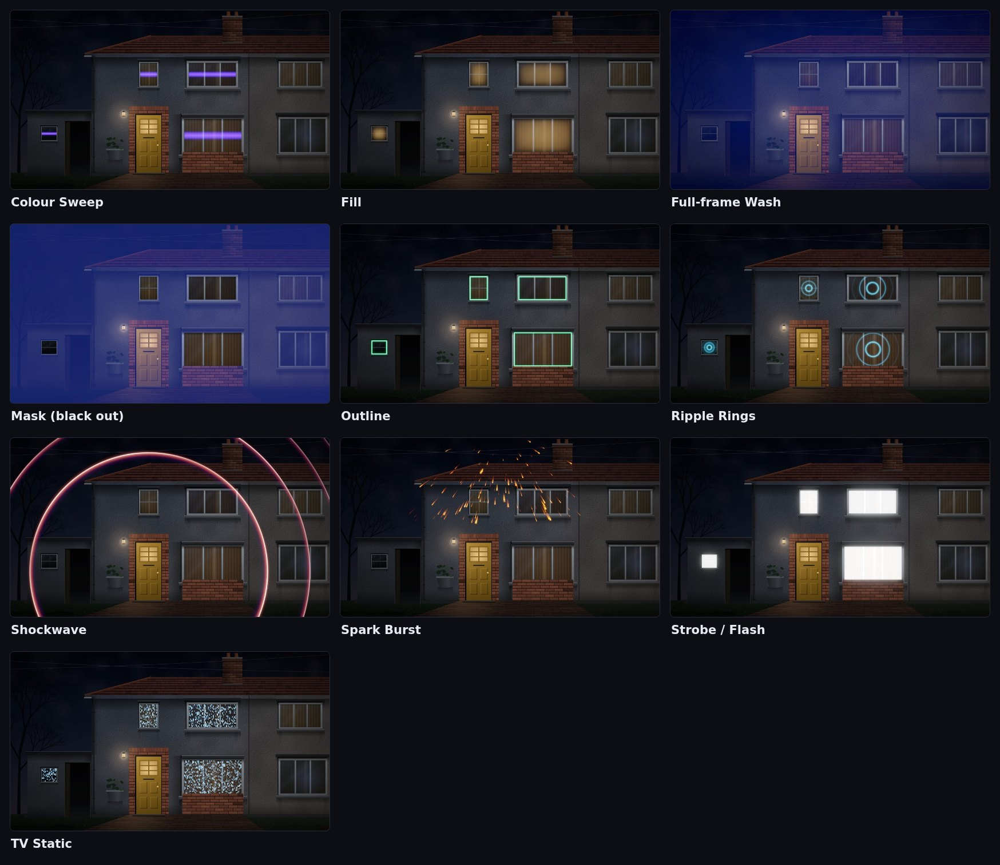

## Paths

Things that run along a traced line — the roofline, the gutter, the arch over
the door — or round the outline of a shape.

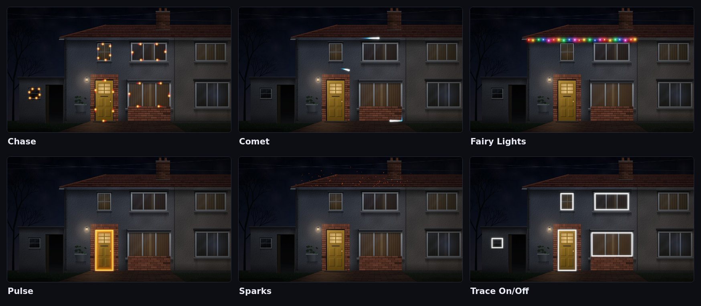

## The facade

The effects that know the windows are there: they grow round them, bounce off
them and cut the wallpaper around them.

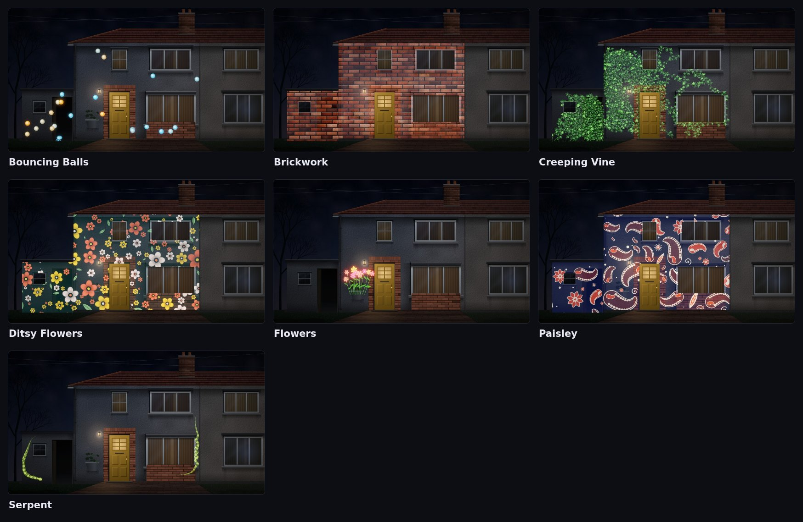

## Atmosphere

The air in front of the house and the light moving through it.

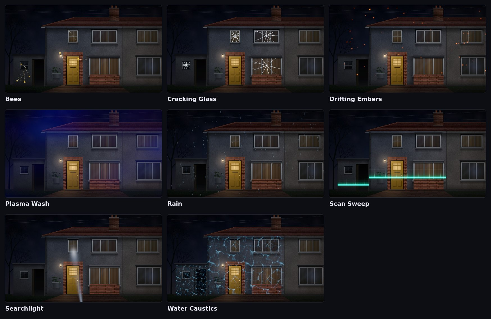

## Halloween

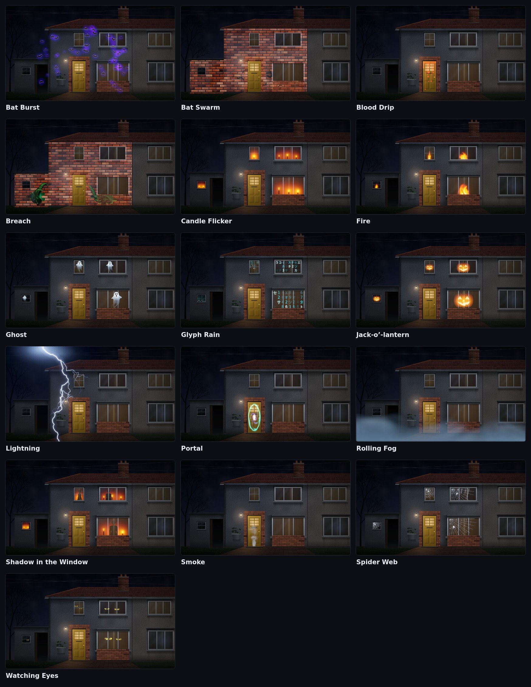

## Christmas

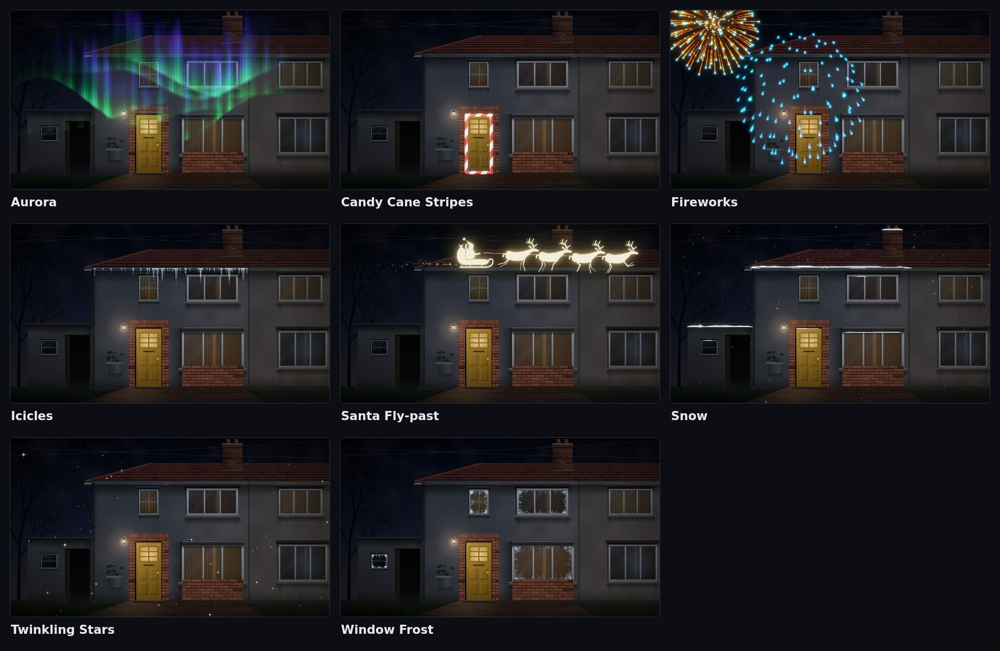

## Celebrations

Birthdays, the Perseids, New Year's Eve and the fifth of November.

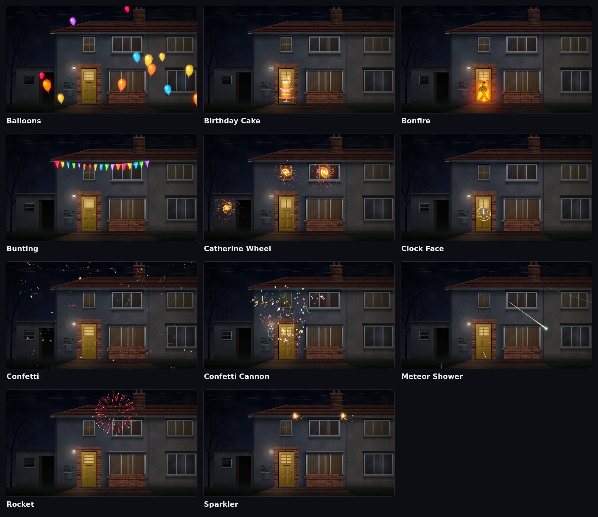

## Night city

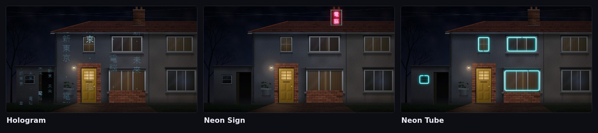

## Under the sea

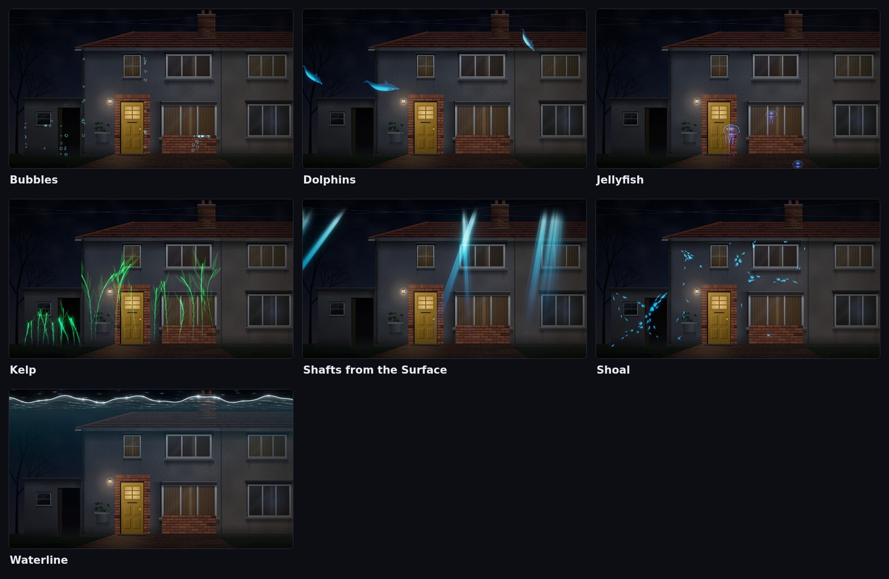

## Text

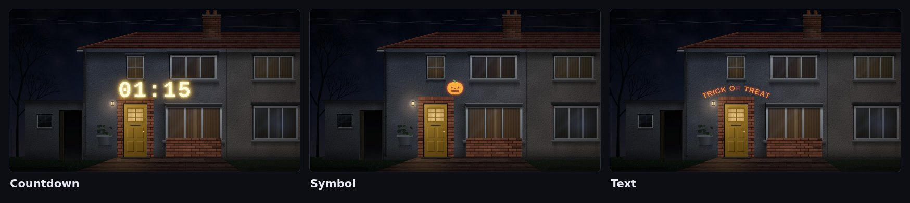

## Media

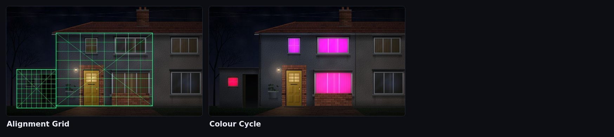
